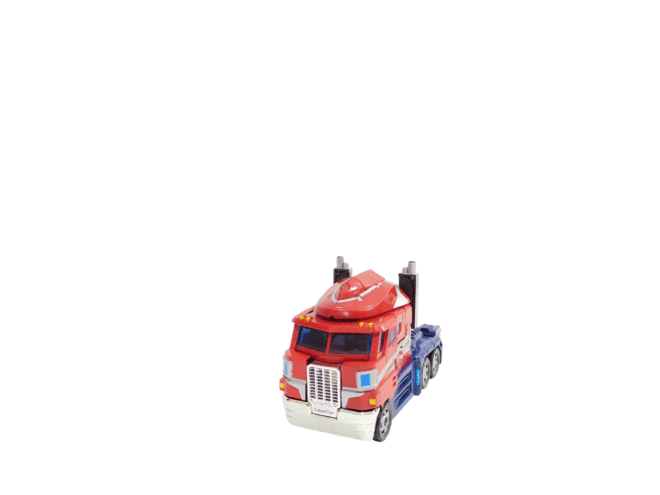

### Testing, testing

1. Motivate the need for tests
2. Show how Rails makes tests plesasant
3. Examples in a hypothetical rails app

---

### A toy's story

  1. Inject plastic, let it cool, pop it out, inspect visually
  2. Separate parts from the mold, shave off snap points, inspect visually
  3. Paint parts, dry
  4. Clip parts together, screw tight
  5. Construct cardboard box with clear window
  6. Put toy in the box, zip tied to be presentable
  7. Pack crate, wrap in plastic, slap on "no razer blades" stickers
  8. Send crate off on a boat
  9. Hope for the best!

---



---

### A toy's story cont.

The box arrives on the US shores and the 35% tarrifs are paid by the importer.

The inspector validates the factory's work.

---

### A toy's story cont.

Visual inspection

   1. Got the right number of toys?
   2. The packages haven't been soaked or otherwise damaged

---

### A toy's story cont.

Quality can be checked through random sampling. Take 10 units from each batch of 1000

   1. Easy to unbox the toy? Does the collector's seal break?
   2. Does the toy's paint looks good? You can tell it's Optimus Prime and not Nemesis Prime?
   3. Does the truck roll?
   4. Can you perform a transform?
   5. Does Optimus Prime hold his Ion Blaster correctly? Does the toy hold a pose?

---

### A toy's story cont.

The tested unit is no longer suitable for sale because the seal is broken. We will not test every unit because then there'd be nothing to sell.

Any issues that reach the kids will become KMart's problem. KMart can refer to the purchase contract to work out reimbursement.

---

### A toy's story cont.

  Q: How does a manfuacturer know that each transform can actually transform from truck to autobot?

  A: They don't! They set up a process to address known sources of defects at every step of the way and routinely train and assess their staff to make sure the process is followed

---

### A toy's story cont.

  Q: Which step in manufacturing is the most economical for addressing systemic issues?

  A: You tell me 😏

---

### A toy's story cont.

  Q: What's the best way to feed changes through the system?

  A: Again, you tell me 😏

---

### A toy's story cont.

  Q: Why does the end quality matter?

  A: Again, you tell me 😏

---

 # Insert gif of Lucy eating chocolates

---

### Metaphysical applications

How does this hypothetical apply to the _craft production_ of the modern software developer?

Have you ever experienced a bug in software?

Do some companies have a better reputation than others? Are you willing to pay a premium for it?

---

### What is quality? cont.

 * An ethos
   * We take a professional responsibility for what we put out in to the world
   * It's gotta be "good" or what are we even doing
   * We don't throw code over a wall and hope for the best, we care that what we deliver works for our end users and doesn't bring shame to our family name

---

### What is quality? cont.

 * A methodology
   * A consistent, reproducible process
   * Change is the only constant, we improve our process whenever we can
   * Measurable outcomes
   * Prevention is our philosphy
   * Detection is our backup

---

### Classical Q&A

Software development used to imply a dedicated Q&A staff:
 * rigorous test procedures
   * a mix of manual and automated
 * black box testing
 * white box testing

This is both expensive and adds to the cycle time of delivering features. It's neither good nor bad, mostly a business and engineering decision.

---

### Shift Left Software Testing

Moving tests earlier in the development process, relying more on an automated test suite executed by the developers

If done right, developers can test as they write new code, creating a tight feedback loop

---

### Model View Controller architecture

An architecture for the construction of database-driven, server-side rendered web apps

I have an idea for Feature X, Improvement Y, or addressing Bug Z

MVC answers: what part of the code is reponsible for that? 🤔

---

### MVC cont.

Each layer has a specific role

Model: data and business logic. Guarantees the database is in accordance with the developer's wishes
View: present the data, build forms for new data. doesn't load data directly
Controller: load data, confirms through models that data looks good, and sends users from one part of the app to another


--

### Many flavors of testing

Nomenclature varies by developer and what side of the bed they woke up on.

But here are the _vibes_:

Unit: Isolate code
 * Models
 * Controller
 * Routes
 * Middleware
 * Much more
Integration: Run through a story from a developer's perspective
 * Ex: A User can create a Post
And more

---

### Fake Rails App

```bash
% rails new the-testing-app --skip-test \
  --skip-docker --skip-action-mailer --skip-action-mailbox \
  --skip-action-text --skip-active-job --skip-active-storage \
  --skip-action-cable --skip-asset-pipeline --skip-javascript \
  --skip-hotwire --skip-jbuilder --skip-system-test \
  --skip-thruster --skip-kamal --skip-solid \
  --skip-devcontainer
```

---

### Adding Rspec

```bash
% cd the-testing-app
% bundle add rspec-rails
% bundle add shoulda-matchers
% bundle exec rails generate rspec:install
      create  .rspec
      create  spec
      create  spec/spec_helper.rb
      create  spec/rails_helper.rb
```

---

### Creating A Model

```bash
% rails generate model user
      invoke  active_record
      create    db/migrate/20241210063609_create_users.rb
      create    app/models/user.rb
      invoke    rspec
      create      spec/models/user_spec.rb
```

```ruby
# app/models/user.rb
class User < ActiveRecord::Base
end
```

---

### Creating A Model Cont.

```ruby
# db/migrate/20241210063609_create_users.rb
class CreateUsers < ActiveRecord::Migration[8.0]
  def change
    create_table :users do |t|
      t.timestamps
      t.string "email"
      t.string "first_name"
      t.string "last_name"
    end
  end
end
```

---

```ruby
# spec/models/user_spec.rb
require 'rails_helper'

RSpec.describe User, type: :model do
  pending "add some examples to (or delete) #{__FILE__}"
end
```

```bash
*

Finished in 0.00661 seconds (files took 2.81 seconds to load)
1 example, 0 failures, 1 pending
```

---

### Unit test: isolating the perfect **slice**

Keep tests small and targeted by isolating the most minimal slice of of the stack.

Remind yourself that you are _not_ testing:

 * The rack middleware
 * The routes
 * The active record library (validation, saving, etc)

You are _only_ testing what you wrote. This can be hard to settle in your brain.

Ex: If postgres fails to persist your data that's a postgres bug, not an application bug

---

### Unit test: validations case study

How about we use the test suite as a backup that the model is properly configured, not the behavior of pre-canned validations

```ruby
class User < ApplicationRecord
  validates_presence_of :email
end
```

```ruby
RSpec.describe User, type: :model do
  describe 'validations' do
    it { should validate_presence_of(:email) } # should-matcher magic
  end
end
```

```
% bundle exec rspec
.

Finished in 0.01929 seconds (files took 1.31 seconds to load)
1 example, 0 failures
```

---

### Unit test: validations case study cont.

We are managing a liability: never let data sneak in without an `email`!

We are not managing:
 * does ActiveRecord catch nil? Empty string?
 * this test does not care about the various flavors of **falsiness**
 * this test prefers **implict**

---

### The duality of app code and test code

Two applications pulling at eachother

 * App code is chock full of features
 * Test code exists to exercise those features
   * Test the happy path
   * Test the unhappy path
   * Keep tests small and direct
     * All levels of developer should be able to easily read them


---

A test is like a bouncing a ball against a wall, the wall is your app, the test is the ball.

Note: Generate a set of pictures showing the same wall copied many times and a ball having different paths. Each test should be "one bounce" to keep it easy to read and follow, if possible.
